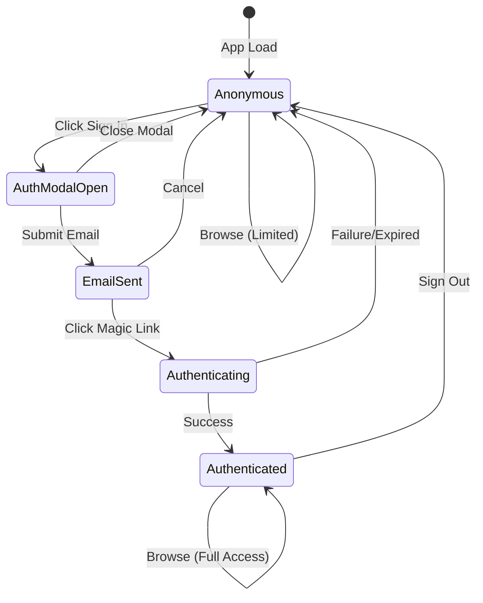
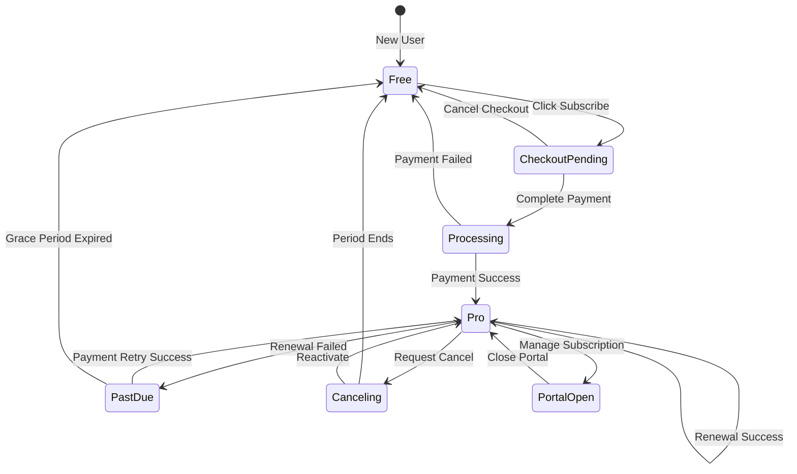
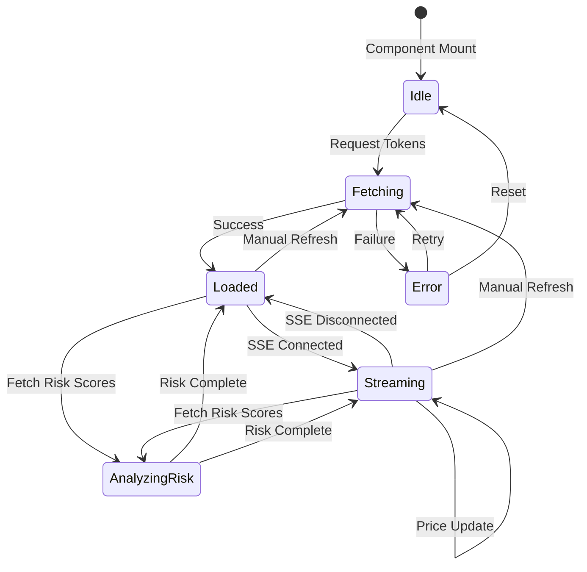
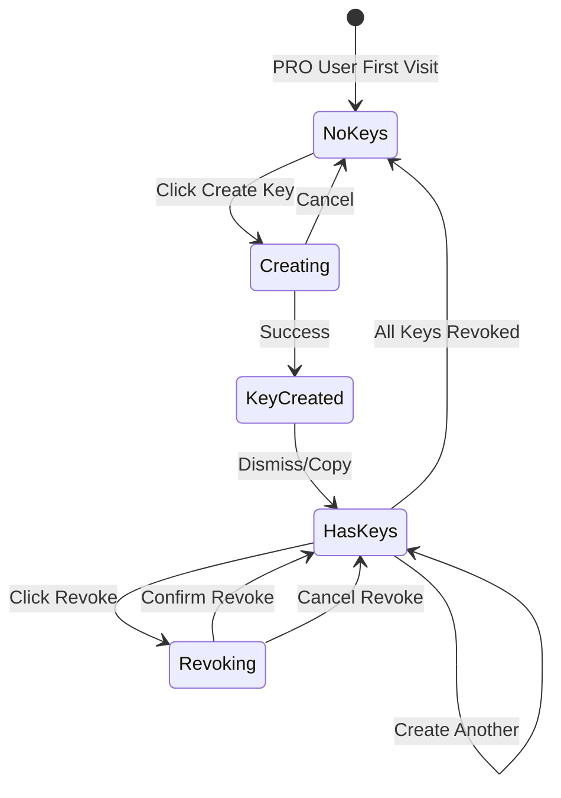
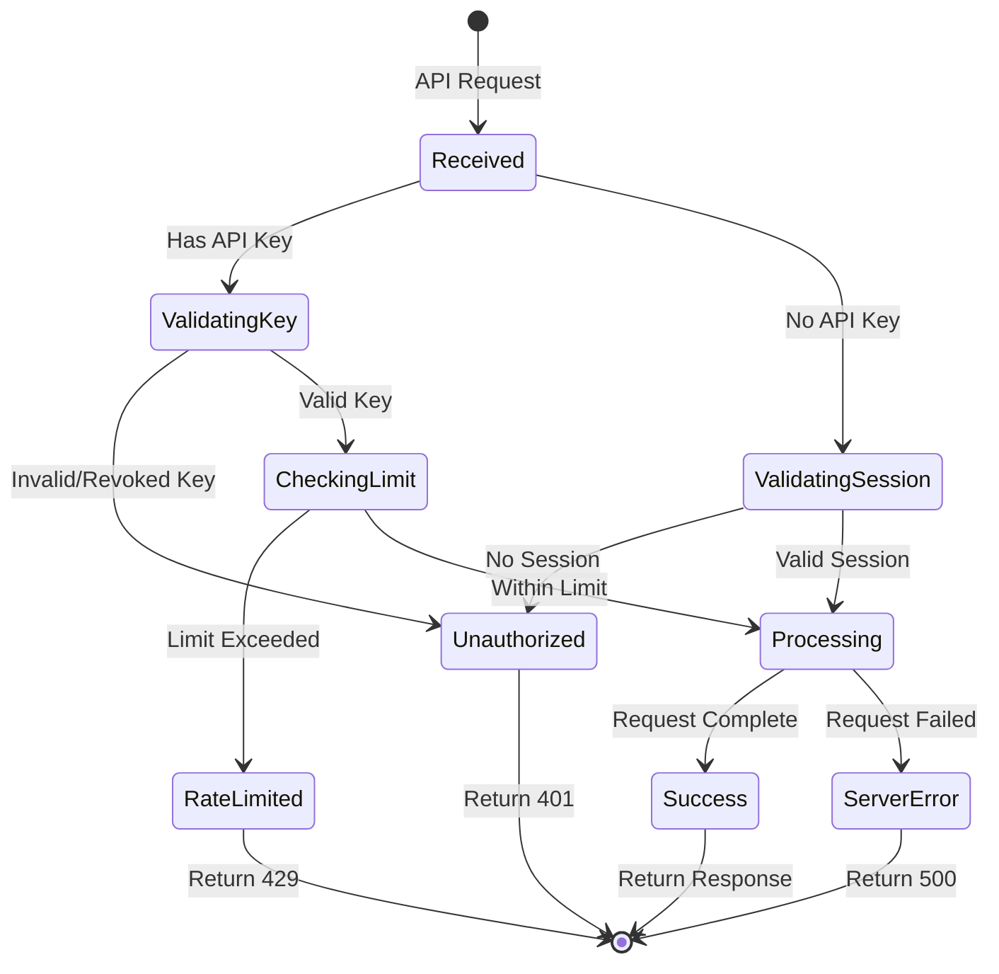
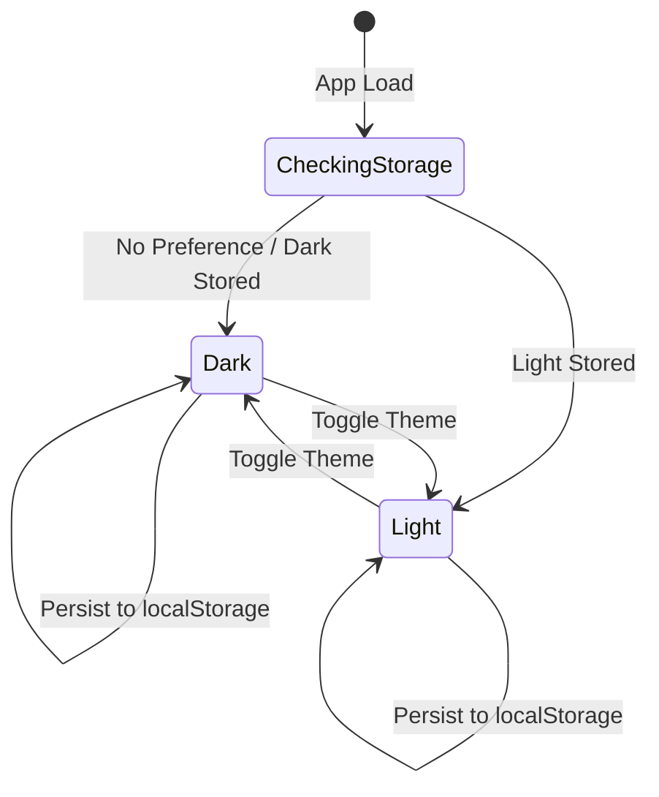
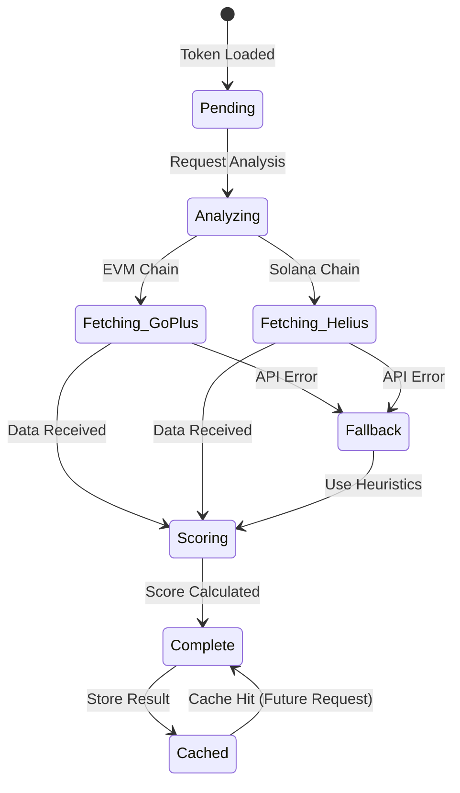
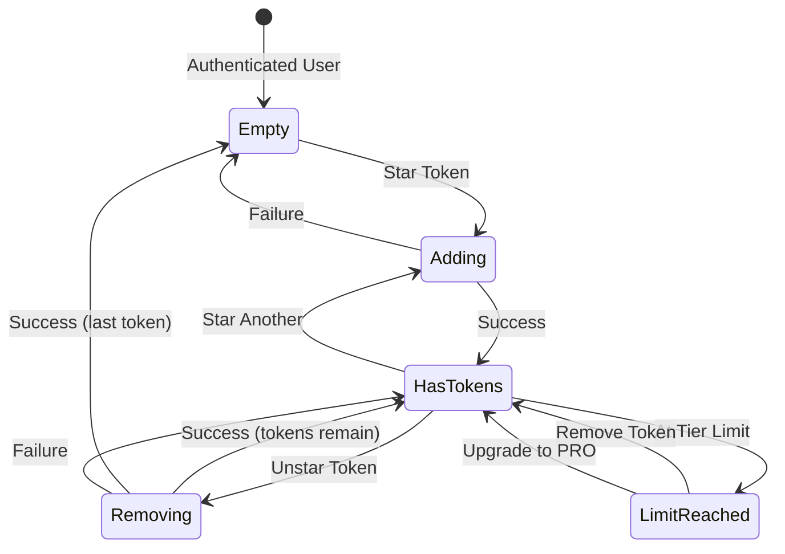
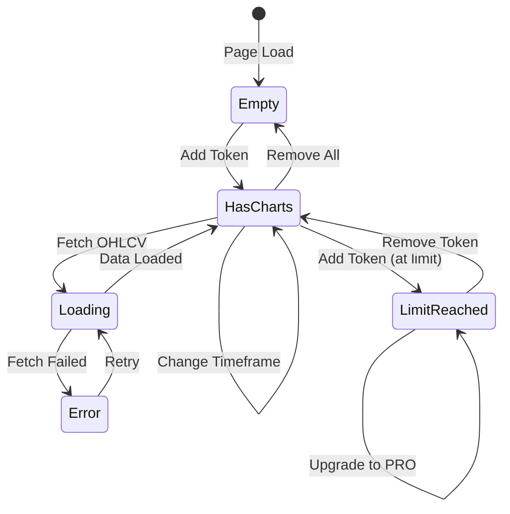
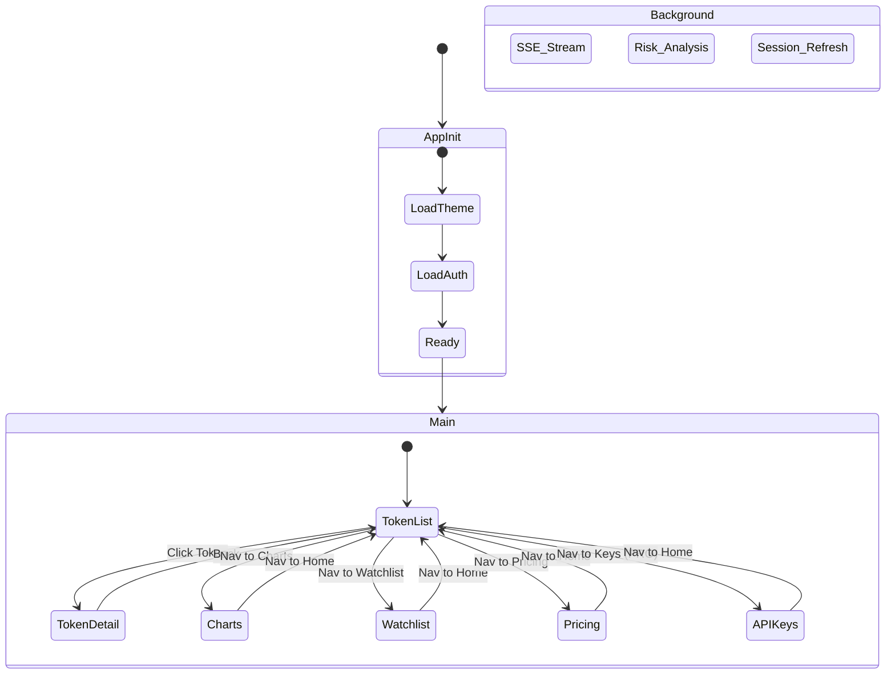

# null//check State Machine Diagrams

This document describes the various state machines that govern the behavior of null//check.

---

## 1. User Authentication State Machine



### States

| State | Description |
|-------|-------------|
| `Anonymous` | User not logged in, limited features |
| `AuthModalOpen` | Authentication modal displayed |
| `EmailSent` | Magic link email sent, waiting for click |
| `Authenticating` | Verifying magic link token |
| `Authenticated` | User logged in with valid session |

### Transitions

| From | To | Trigger |
|------|-----|---------|
| Anonymous | AuthModalOpen | User clicks "Sign In" |
| AuthModalOpen | EmailSent | User submits email |
| EmailSent | Authenticating | User clicks magic link |
| Authenticating | Authenticated | Token valid |
| Authenticated | Anonymous | User signs out or session expires |

---

## 2. Subscription State Machine



### States

| State | Description |
|-------|-------------|
| `Free` | Default tier, limited features |
| `CheckoutPending` | User in Stripe checkout flow |
| `Processing` | Payment being processed |
| `Pro` | Active PRO subscription |
| `PastDue` | Payment failed, in grace period |
| `Canceling` | Subscription set to cancel at period end |
| `PortalOpen` | Stripe customer portal open |

### Feature Access by State

| Feature | Free | Pro | PastDue | Canceling |
|---------|------|-----|---------|-----------|
| Watchlist Tokens | 10 | ∞ | ∞ | ∞ |
| Chart Slots | 4 | 16 | 16 | 16 |
| Alerts | 3 | ∞ | ∞ | ∞ |
| Top Holders | 5 | 20 | 20 | 20 |
| API Keys | ✗ | ✓ | ✓ | ✓ |

---

## 3. Token Data State Machine



### States

| State | Description |
|-------|-------------|
| `Idle` | Initial state, no data loaded |
| `Fetching` | API request in progress |
| `Loaded` | Token data loaded, no live updates |
| `Streaming` | SSE connected, receiving live updates |
| `AnalyzingRisk` | Batch risk analysis in progress |
| `Error` | Request failed |

### Data Flow

```
┌─────────────┐     ┌─────────────┐     ┌─────────────┐
│  API Call   │────▶│   Tokens    │────▶│   Zustand   │
│  /api/tokens│     │   Store     │     │    State    │
└─────────────┘     └─────────────┘     └─────────────┘
                           │
                           ▼
                    ┌─────────────┐
                    │  SSE Stream │
                    │ /api/stream │
                    └─────────────┘
                           │
                           ▼
                    ┌─────────────┐
                    │ Price Flash │
                    │  Animation  │
                    └─────────────┘
```

---

## 4. API Key State Machine



### States

| State | Description |
|-------|-------------|
| `NoKeys` | User has no active API keys |
| `Creating` | Create key form active |
| `KeyCreated` | New key created, showing secret |
| `HasKeys` | User has one or more active keys |
| `Revoking` | Revocation confirmation pending |

### API Key Lifecycle

```
┌──────────┐     ┌──────────┐     ┌──────────┐     ┌──────────┐
│  Create  │────▶│  Active  │────▶│  Revoked │────▶│ Deleted  │
│          │     │          │     │          │     │(Soft Del)│
└──────────┘     └──────────┘     └──────────┘     └──────────┘
                      │
                      ▼
                ┌──────────┐
                │   Used   │
                │ (Update  │
                │last_used)│
                └──────────┘
```

---

## 5. API Request State Machine (Agent Access)



### States

| State | Description |
|-------|-------------|
| `Received` | Request received by server |
| `ValidatingKey` | Checking API key validity |
| `ValidatingSession` | Checking user session |
| `CheckingLimit` | Verifying daily usage limit |
| `Processing` | Executing request logic |
| `Success` | Request completed successfully |
| `Unauthorized` | Authentication failed |
| `RateLimited` | Daily limit exceeded |
| `ServerError` | Internal error occurred |

### Response Codes

| Code | State | Description |
|------|-------|-------------|
| 200 | Success | Request successful |
| 401 | Unauthorized | Invalid credentials |
| 429 | RateLimited | Too many requests |
| 500 | ServerError | Internal error |

---

## 6. Theme State Machine



### States

| State | Description |
|-------|-------------|
| `CheckingStorage` | Reading localStorage on load |
| `Dark` | Dark theme active (default) |
| `Light` | Light theme active |

### CSS Variables by Theme

| Variable | Dark | Light |
|----------|------|-------|
| `--bg-primary` | #000000 | #EDEBE6 |
| `--bg-secondary` | #0a0a0a | #E5E3DE |
| `--text-primary` | #d0d0d0 | #1A1A1A |
| `--border` | #333333 | #1A1A1A |

---

## 7. Risk Analysis State Machine



### Risk Score Calculation

```
┌─────────────────────────────────────────────────────────┐
│                    Total Risk Score                      │
├─────────────┬─────────────┬─────────────┬──────────────┤
│  Honeypot   │  Contract   │   Holders   │  Liquidity   │
│  (0-50pts)  │  (0-30pts)  │  (0-25pts)  │  (0-25pts)   │
└─────────────┴─────────────┴─────────────┴──────────────┘
                           │
                           ▼
              ┌────────────────────────┐
              │     Risk Level         │
              │  LOW: 0-14             │
              │  MEDIUM: 15-29         │
              │  HIGH: 30-49           │
              │  CRITICAL: 50+         │
              └────────────────────────┘
```

---

## 8. Watchlist State Machine



### States

| State | Description |
|-------|-------------|
| `Empty` | No tokens in watchlist |
| `Adding` | Adding token to watchlist |
| `HasTokens` | Watchlist has tokens |
| `Removing` | Removing token from watchlist |
| `LimitReached` | At tier limit (Free: 10, Pro: ∞) |

---

## 9. Chart Grid State Machine



### Chart Limits by Tier

| Tier | Max Charts |
|------|------------|
| Free | 4 |
| PRO | 16 |

---

## 10. Complete Application State Overview



---

## State Store Structure (Zustand)

```typescript
// Token Store
interface TokensState {
  tokens: TokenWithMetrics[];
  isLoading: boolean;
  error: string | null;
  setTokens: (tokens: TokenWithMetrics[]) => void;
  updateToken: (address: string, updates: Partial<TokenWithMetrics>) => void;
}

// Theme Store
interface ThemeState {
  theme: 'dark' | 'light';
  toggleTheme: () => void;
  setTheme: (theme: 'dark' | 'light') => void;
}

// Chart Grid Store
interface ChartGridState {
  tokens: ChartToken[];
  layout: 'auto' | '2x2' | '3x3';
  timeframe: '1h' | '4h' | '1d' | '1w';
  addToken: (token: ChartToken) => void;
  removeToken: (address: string) => void;
  setLayout: (layout: GridLayout) => void;
  setTimeframe: (timeframe: ChartTimeframe) => void;
}

// Filter Store
interface FiltersState {
  chain: ChainId | null;
  sortField: SortField;
  sortDirection: 'asc' | 'desc';
  searchQuery: string;
  setChain: (chain: ChainId | null) => void;
  setSort: (field: SortField, direction: 'asc' | 'desc') => void;
  setSearch: (query: string) => void;
}
```

---

## Event Flow Diagram

```
User Action          Frontend State       API Call           Database
    │                     │                  │                  │
    ▼                     ▼                  ▼                  │
[Click Star] ──────▶ [Optimistic  ] ──────▶ [POST          ] ──┼──▶ [INSERT]
                     [Update UI   ]         [/api/watchlist]   │
                           │                      │            │
                           │◀─────────────────────┘            │
                     [Confirm/     ]◀───────────────────────────┘
                     [Rollback     ]
                           │
                           ▼
                     [Final State  ]
```

---

*Generated for null//check - The risk-first DEX screener*
